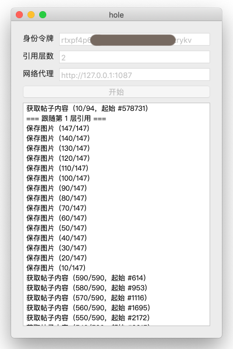
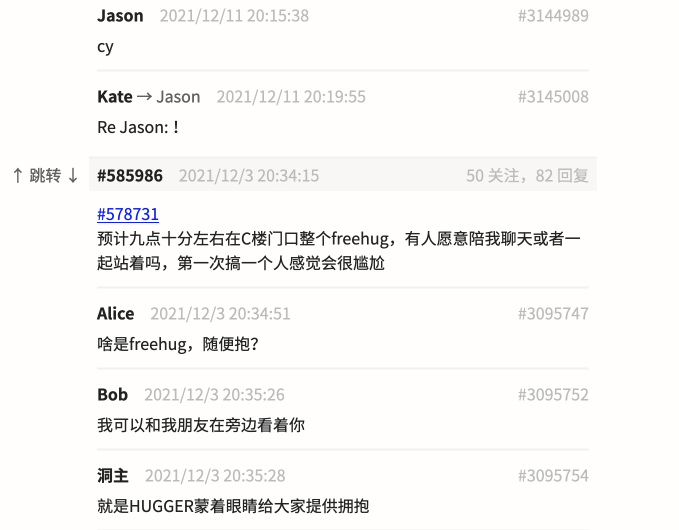

## 🌐 在线版

在线版位于 [hole.botany.run](https://hole.botany.run/)。登录凭据不会被保存，理论上也不会泄露，但为安全起见，完成备份后建议注销后重新登录。

⚠️ 在线版抓取到的文字和图片可能会被合并归档，参与其他的树洞备份项目。此过程不会保留任何个人信息（如关注列表、投票），独立的备份压缩包将在事后全部删除，望知晓。

## 说明



#### 操作方法

1. 首先获得自己的令牌（token），具体参见树洞 [#595705](https://web.thuhole.com/##595705)。
2. 把 token 粘贴在“身份令牌”一栏中。
3. 选择“引用层数”，如指定为 2，则会保存所有关注的树洞、它们提到的树洞以及【它们提到的树洞中提到的树洞】。
4. 取决于访问树洞的方式，可能需要填写网络代理。若不了解，可尝试留空。
5. 点击“开始”，等待即可。

备份的内容会集中存放到程序所在位置旁边，其中包含一个网页 `index.html`，用浏览器打开之即可。



#### 常见问题

1. 提示“登录凭据已过期”
  - token 由数字与字母组成，请检查是否粘贴了多余内容如冒号、空格等。
2. 点击开始后长时间无反应
  - 请在树洞中提问并附上当前访问树洞的方式。

Enjoy

## crawler\_595732.html

另外，如果已经使用 [#595732](https://web.thuhole.com/##595732) 提供的方法爬取关注列表，请直接下载 [crawler\_595732.html](https://raw.githubusercontent.com/kawa-yoiko/treasure-hole/master/crawler_595732.html)，在浏览器中打开，选择爬取到的 JSON 文件即可。

## 技术信息

主程序：使用 [Rust](https://www.rust-lang.org/) 编译器构建。

```sh
cargo build --release

# 运行图形界面
cargo run --release
# 从命令行获取参数
cargo run --release -- <token> <levels> <output_dir> [<proxy>]
```

服务端：使用 [Deno](https://deno.land/) 运行。

```sh
cd server
deno run --allow-net --allow-run --allow-read server.js
```
